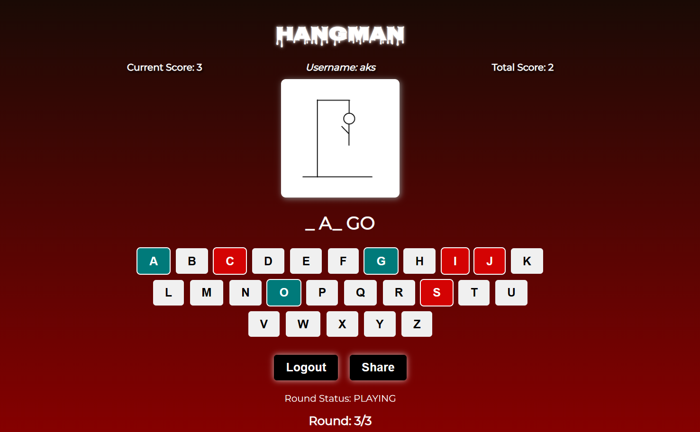

# Hangman Game

Hangman is an interactive word guessing game.

### Rules:
- At the beginning of the game, the player is assigned 7 points and 7 lives.
- For each incorrect guess, one point and one life is deducted.
- If the player guesses a letter that appears in the word, they earn points equal to the number of occurrences of that letter in the word.
- If the player guesses the word correctly before running out of points or lives, they win the round and receive a score equal to the number of remaining points or lives.
- If the player runs out of lives before guessing the word correctly, they lose the round and receive a score of zero.
- This game consists of 3 rounds. Each round will have one word. The cumulative score of these three rounds will be saved after the game ends.

### Link Sharing Feature:
Users can set a word for a single session and give the link to somebody else to play and guess that word.

## Images

### Hosted URL: 
https://anahar1.github.io/hangman-game/

### Built with:
React and Firebase

### Contributers:
Anish Nahar, Akshay Reddy Kola, Sourabh

This project was made as a submission in the Lighthall Software Engineering Super League 1 - Level 3.